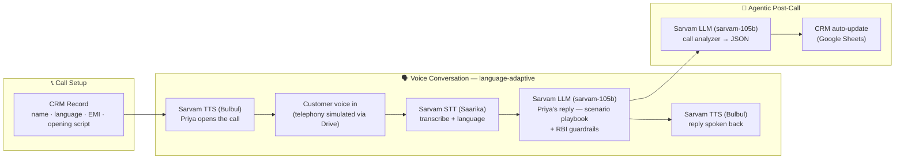

# Priya - Multilingual Voice Collections Agent

**A voice bot + agentic workflow (A+B) for BFSI loan collections, powered end-to-end by Sarvam AI. Built 100% no-code in n8n.**

Priya places outbound EMI reminder calls for *Sunrise Finance*, a fictional NBFC. She opens each call in the customer's registered language, understands code-mixed replies (Hinglish, Tanglish), responds empathetically within RBI Fair Practices guardrails - and after every call, an agentic pipeline analyzes the conversation and updates the CRM autonomously. No human touches the loop.

---

## 🎥 Demo Video

**▶ [Watch the demo walkthrough](https://www.loom.com/share/b211fc661e9d41de96f487c0f3d4bb41)**
...
**📊 [Live CRM sheet](https://docs.google.com/spreadsheets/d/1NhDuriRf7-jv3Ee5B0QHxacKATQ5PlheAR0gZ-n_x7Q/edit?usp=sharing)** - auto-updated by the agent after every call.


The demo shows two live calls through the **same workflow** — only the CRM record changes between them:

| | Call 1 | Call 2 |
|---|---|---|
| Customer | Rajesh Kumar (PL-4321, EMI ₹8,450) | Muthu (PL-4322, EMI ₹9,000) |
| Language | Hindi / **Hinglish** | Tamil / **Tanglish** |
| Scenario | Job loss → **hardship** | Salary delay → **promise-to-pay** |
| Priya's behaviour | Empathy, part-payment option, senior-officer escalation | Confirms commitment, sends payment link |
| CRM outcome (auto-logged) | `hardship` · escalation **TRUE** | `promise_to_pay` · **2026-07-15** captured · escalation FALSE |

---

## 🏗 Architecture



**Design principle - the CRM record drives everything.** One `Edit Fields` node holds the customer record (name, loan, EMI, registered language, opening script, audio reference). The opening TTS, the STT language hint, the LLM prompt, and the CRM log all read from it. Switching customer/language/scenario = changing one record — exactly how a production dialer queue would feed the pipeline.

### Simulation boundaries (PoC, by design)
| Production component | PoC stand-in |
|---|---|
| Telephony stream (Plivo / LiveKit) | Recorded customer clip fetched from Google Drive |
| Dialer queue from LMS/CRM | Manually loaded CRM record node |
| Core CRM / LMS | Google Sheets (`Sunrise_Collections_CRM`) |

---

## 🔌 Sarvam APIs used - and why

| API | Model | Role in the solution | Why it matters |
|---|---|---|---|
| **Speech-to-Text** (`/speech-to-text`) | **Saarika v2.5** | Transcribes the customer's reply in the source language; the CRM record's registered language is passed as a hint for robust code-mix handling | Faithful Hinglish/Tanglish transcription in native scripts — the foundation of language-adaptive replies |
| **Chat Completions** (`/v1/chat/completions`) | **sarvam-105b** | ① Priya's brain: a 6-scenario collections playbook (pay-now, promise-to-pay, hardship, dispute, wrong-person, refusal) with RBI Fair Practices guardrails, replying in the customer's language • ② Post-call analyzer: strict-JSON extraction of scenario, sentiment, promise-to-pay date, escalation flag | One model, two distinct jobs — conversation and structured analysis — both grounded in Indian-language context |
| **Text-to-Speech** (`/text-to-speech`) | **Bulbul v2** | ① Speaks Priya's opening from the CRM script in the registered language • ② Speaks her generated reply back to the customer | Natural Indian voices across languages; same agent persona ("Priya") in every language |

> Note: Saarika (transcribe-in-source-language) is used rather than Saaras (translate-to-English) deliberately — Priya must hear and reply in the customer's own language, not an English translation.

---

## 🧭 Workflow node map

| # | Node | Type | Purpose |
|---|---|---|---|
| 1 | CRM — Fetch Customer Record | Edit Fields | The driving record: `customer_name`, `loan_id`, `emi_amount`, `preferred_language`, `opening_text`, `drive_file_id` |
| 2 | Sarvam TTS — Priya Opens Call (Bulbul) | HTTP Request | Generates the opening line in the registered language |
| 3 | Save Opening Audio | Convert to File | Playable `.wav` of the opening |
| 4 | Customer Voice In (Telephony Sim) | HTTP Request | Fetches the customer's recorded reply from Drive |
| 5 | Sarvam STT — Saarika | HTTP Request | Transcript + language code (CRM-hinted) |
| 6 | Sarvam LLM — Priya Reply (sarvam-105b) | HTTP Request | Scenario-based, language-matched reply |
| 7a/7b | Sarvam TTS — Speak Reply → Save Reply Audio | HTTP Request + Convert to File | Priya's spoken reply as `.wav` |
| 8a/8b | Sarvam LLM — Post-Call Analyzer → Parse Analysis | HTTP Request + Code | Strict-JSON call analysis (scenario, sentiment, PTP date, escalation, summary) |
| 9 | CRM Update — Log Disposition | Google Sheets | Appends the disposition row autonomously |

---

## ⚙️ Setup instructions

**Prerequisites:** an [n8n Cloud](https://n8n.io) account (free trial works) · a [Sarvam API key](https://dashboard.sarvam.ai) · a Google account (Drive + Sheets).

1. **Import the workflow** — n8n → *Create Workflow* → ⋯ menu → *Import from File* → `src/priya_collections_workflow.json`.
2. **Sarvam credentials** — create two n8n *Header Auth* credentials using your Sarvam API key:
   - `api-subscription-key: <key>` → assign to nodes 2, 5, 7a (STT/TTS endpoints)
   - `Authorization: Bearer <key>` → assign to nodes 6, 8a (Chat Completions)
3. **Google Sheets** — create a sheet named `Sunrise_Collections_CRM` with header row:
   `Timestamp | Customer | Loan | Language | Scenario | Disposition | PTP_Date | Amount | Escalation | Summary`.
   In node 9, sign in with Google and select this sheet (*Append Row*).
4. **Customer audio** — upload a customer reply clip (`.wav`) to Google Drive, set sharing to *Anyone with the link → Viewer*, and put its file ID into node 1's `drive_file_id`. Sample clips are in `/demo/audio` (or generate your own with a one-off Bulbul TTS call).
5. **Load a customer record** in node 1 (both demo records are pre-documented in the table above) and **Execute Workflow**.

**What a successful run produces:** playable opening + reply audio (nodes 3, 7b) and a new disposition row in the sheet (node 9).

---

## 📁 Repository structure

```
README.md
src/
  priya_collections_workflow.json   # full n8n workflow export (no secrets)
  .env.example                      # key reference (keys live as n8n credentials)
docs/
  Priya_Business_Writeup.pdf        # 7-slide customer-ready deck in pdf
  architecture_diagram.png          # annotated n8n canvas
demo/
  audio/                            # sample call audio (openings, customer clips, replies)
```

---

## 🚧 Limitations & 90-day path to production

**Deliberately out of PoC scope:** live telephony (simulated with recorded clips) · identity verification before discussing loan details (mandatory for production BFSI) · multi-turn conversation memory (single exchange per call) · real CRM/LMS integration (Sheets stand-in).

**90-day rollout:** *Days 0–30* — live telephony (Plivo / LiveKit + Sarvam streaming), identity verification, 1 language, 1 product · *Days 31–60* — multi-turn memory, LMS/CRM + payment-gateway integration, 3 languages, human hand-off desk · *Days 61–90* — on-prem / private-VPC deployment for data sovereignty, QA dashboards, RBI-ready audit trails, all-language rollout. Every step is an integration, not a redesign — the Sarvam pipeline stays the same.

---

*Built by Abhinav Kumar Mishra for the Sarvam AI Pre-Sales Engineer assignment · July 2026*
